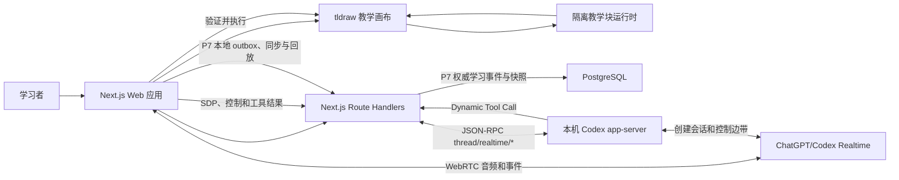

# AI Tutor MVP 系统架构

## 1. 文档状态

- 状态：`APPROVED`
- 当前约束：`P8_IN_PROGRESS / ALL_POST_P7_PHASES_AUTHORIZED / PURCHASES_EXCLUDED`；P6 与 P7 已于 2026-08-02 获用户明确批准。P8、部署、真人研究和后续阶段均已授权，但禁止任何购买；缺少的真人、法务和比赛证据不得由机器测试替代。
- 关联文档：
  - `MVP_SPEC.md`
  - `IMPLEMENTATION_PLAN.md`
  - `deep-research-report.md`

## 2. 已确认的技术决策

| 领域 | 决策 |
|---|---|
| 语言 | 全 TypeScript |
| 项目形态 | pnpm workspace 单仓库、模块化单体 |
| Web 应用 | Next.js、React |
| UI | 当前使用 React 与手写 CSS；Tailwind 工具链已安装，shadcn/ui 未实现 |
| 无限画布 | tldraw 自定义 Shape |
| 代码编辑 | 当前为受约束的原生 CSS 输入；CodeMirror 6 仅是后续候选 |
| 简单 HTML/CSS 运行 | 自有沙箱化 iframe 运行时 |
| 完整 React 运行 | 预留 Sandpack 适配器，MVP 不实现 |
| 实时语音 | 本机 Codex app-server Realtime V3、WebRTC |
| AI 事件 | Codex app-server JSON-RPC、WebRTC DataChannel、结构化 Dynamic Tools |
| 数据库 | P7 使用 Drizzle/PostgreSQL 保存当前设备的权威学习事件与快照；数据库不可用时浏览器 outbox 保留未发送事件 |
| 身份 | MVP 支持匿名学习会话，后续接 Auth.js |
| 测试 | Vitest、Playwright |

第一版不拆分独立后端服务。

Next.js Route Handlers 当前提供业务 API、P7 学习证据/快照/回放接口和 Codex app-server Realtime 桥接。

## 3. 系统上下文



## 4. 单仓库结构

计划使用以下边界：

```text
apps/
  web/
    app/                    Next.js 页面与 Route Handlers
    features/
      canvas/               tldraw 集成和画布交互
      blocks/               教学块 React 组件
      import/               文件导入和规范化
      inspector/            DOM、计算样式和规则检查
      comparison/           并排、揭示滑块和代码差异
      tutor/                Realtime 会话和教学编排
      learning/             P7 学习证据、恢复与回放
    db/                     Drizzle schema 和数据访问
packages/
  contracts/                API、事件、工具和 iframe 协议
  runtime-core/             RuntimeAdapter 和通用运行时类型
  runtime-static-html/      静态 HTML/CSS 运行时
  teaching-model/           教学块、版本和课程领域类型
  test-fixtures/            盒模型、Flex、定位验收样例
```

模块之间只能通过 `packages/contracts` 和明确的领域接口通信。

不得从 AI、画布或 iframe 中直接跨模块访问数据库。

## 5. 核心模块

### 5.1 Canvas Shell

职责：

- 初始化和持有 tldraw Editor。
- 注册自定义教学块 Shape。
- 管理视口、选择、拖动、缩放、分组和连接。
- 根据 AI 或用户动作创建、更新和聚焦教学块。
- 将 tldraw Shape ID 映射到语义教学块 ID。

Canvas Shell 不负责：

- 执行用户代码。
- 解析 AI 自由文本为数据库写操作。
- 直接保存 Realtime 原始事件。

### 5.2 Teaching Block Renderer

每种教学块使用独立的类型化 props 和 React 组件。

建议领域联合类型：

```ts
type TeachingBlock =
  | ExplanationBlock
  | RunnableBlock
  | ComparisonBlock
  | CssControllerBlock
  | AnnotationBlock
  | GroupBlock;
```

教学块数据与 tldraw 的交互行为分离：

- tldraw Shape 负责位置、尺寸、选择和连接。
- Teaching Block 负责教学语义、代码版本和运行状态。

### 5.3 Import Pipeline

导入管线分为五步：

```text
读取文件
→ 验证文件类型和大小
→ 建立不可变 ImportSnapshot
→ 解析引用并规范化资源 URL
→ 交给匹配的 RuntimeAdapter
```

导入结果使用通用结构：

```ts
interface NormalizedProject {
  runtimeType: string;
  entryFile: string;
  files: Record<string, NormalizedFile>;
  assetManifest: AssetManifest;
  diagnostics: ImportDiagnostic[];
}
```

不得在核心数据中假定所有项目永远是静态 HTML。

### 5.4 Runtime Adapter

统一运行时接口：

```ts
interface RuntimeAdapter {
  readonly id: string;
  readonly capabilities: RuntimeCapabilities;

  canImport(files: ImportedFile[]): boolean;
  normalize(files: ImportedFile[]): Promise<NormalizedProject>;
  createRuntime(
    project: NormalizedProject,
    options: RuntimeOptions
  ): Promise<RuntimeHandle>;
}

interface RuntimeHandle {
  render(revision: CodeRevision): Promise<RenderResult>;
  inspect(target: ElementTarget): Promise<InspectionResult>;
  applyTransientStyle(change: CssControlChange): Promise<void>;
  resetTransientState(): Promise<void>;
  dispose(): Promise<void>;
}
```

第一版只实现：

```text
StaticHtmlCssAdapter
```

预留但不实现：

```text
VanillaJavaScriptAdapter
ReactSandpackAdapter
VueAdapter
WebContainerAdapter
```

### 5.5 Static HTML/CSS Sandbox

每个 `runnable` 教学块拥有独立 iframe。

建议 iframe 安全策略：

- 使用 `sandbox`，只开放运行内部桥接代码所需的最小能力。
- 不使用 `allow-same-origin`。
- 不执行导入文件中的脚本。
- 通过 CSP 默认阻止外部网络、表单和顶层导航。
- 本地图片和字体转换为受控 Blob URL。
- 不允许教学块访问主应用 DOM、Cookie、Local Storage 或认证信息。

为了支持元素检查，运行时注入受控桥接代码。

桥接代码只允许：

- 选择元素。
- 读取计算样式。
- 读取盒模型尺寸。
- 枚举与目标元素相关的已解析 CSS 规则。
- 应用临时 CSS 实验值。
- 报告运行时错误。

### 5.6 Element Inspector

`InspectionResult` 至少包含：

```ts
interface InspectionResult {
  target: ElementTarget;
  domPath: string;
  tagName: string;
  attributes: Record<string, string>;
  boundingRect: Rect;
  boxModel: BoxModelMetrics;
  computedStyles: Record<string, string>;
  matchedRules: MatchedCssRule[];
}
```

元素定位不能依赖数据库中的裸 DOM 对象。

使用稳定的目标描述，例如运行实例 ID、DOM path 和必要的结构指纹。

### 5.7 Comparison Engine

比较引擎只引用不可变代码版本：

```ts
interface ComparisonSpec {
  beforeRevisionId: string;
  afterRevisionId: string;
  mode: "side-by-side" | "wipe" | "code-diff";
  syncViewport: boolean;
  focusTarget?: ElementTarget;
}
```

揭示滑块通过两个相同尺寸的隔离渲染结果叠加并裁切实现。

比较引擎不能通过修改原始版本制造“修改后”状态。

### 5.8 CSS Control Engine

CSS 控制器绑定：

- 运行实例。
- 目标元素。
- CSS 属性。
- 值类型。
- 范围或枚举集合。
- 原始值。
- 当前临时值。

数值拖动只更新运行时临时状态。

用户点击“保存实验”后：

1. 生成明确的 CSS 修改。
2. 建立新代码版本。
3. 将比较块指向旧版本与新版本。
4. 清除临时状态。

### 5.9 Realtime Tutor Orchestrator

浏览器生成 WebRTC SDP offer，通过 Next.js Route Handler 请求本机 Codex
app-server 启动线程级 Realtime V3 会话。app-server 返回的 SDP answer 再交给
浏览器完成连接。浏览器不接收 Codex OAuth Token，也不直接调用
`chatgpt.com/backend-api/codex/*`。

通道职责：

- WebRTC Media：用户和 AI 的实时音频。
- WebRTC DataChannel：Realtime 客户端和服务端事件。
- app-server JSON-RPC：`thread/realtime/start`、转录、错误、停止和 SDP 通知。
- Dynamic Tools：Codex 请求应用执行结构化教学动作。
- REST：保存业务数据、代码版本、事件和快照。

浏览器的 VAD 在语音结束时先启动本地意图输出门，避免 AI 字幕或音频早于最终用户
转写而泄漏。概念问答在转写分类后恢复；画布任务保持静音并过滤过程播报，首个成功
变更经过 animation frame 可见后显示确定性学生确认，模型事实结果字幕出现时再恢复
输出。确认音、最终用户转写、首模型音频能量、画布可见 T1 和首有意义字幕分别记录。

AI 不直接接触 tldraw Editor、数据库或 iframe DOM。

首版 Provider 约束：

- 默认 Realtime 协议为 V3，输出为音频，默认模型配置为
  `gpt-live-1-codex`。
- 上述模型名和 ChatGPT/Codex 上游路由属于实验实现细节，不作为浏览器协议
  或领域模型的一部分。
- `RealtimeProvider` 隔离 app-server JSON-RPC；未来可以替换为公开 OpenAI
  Realtime API，而不改画布工具协议。
- app-server 由服务端进程通过 stdio 启动或连接；不得从浏览器访问其本地
  transport。
- 不读取 `~/.codex/auth.json`，不转发、不记录、不返回 OAuth Token。
- app-server 不可用、未登录或账户无语音权限时，返回稳定诊断并保留已有画布。

建议 MVP 工具集合：

```text
read_canvas_state
read_block_state
inspect_element
create_explanation_block
create_runnable_block
fork_code_revision
create_comparison
add_css_controller
focus_block
connect_blocks
run_block
summarize_learning
```

所有工具参数必须：

- 使用 Zod 校验。
- 检查目标画布和会话权限。
- 检查目标实体是否存在。
- 生成幂等键或调用 ID。
- 将执行结果写入事件日志。
- 返回结构化成功或失败结果。

未注册工具、非法参数和越权实体 ID 必须拒绝。

### 5.10 Persistence and Replay

系统使用双层状态：

1. 语义状态：
   - 教学块。
   - 导入快照。
   - 代码版本。
   - 比较关系。
   - 教学会话。
2. 画布状态：
   - tldraw 文档快照。
   - Shape 位置、尺寸、连接、分组和视口。

回放使用：

- 追加式事件流。
- 定期画布和语义快照。
- 严格递增的会话序号。

回放从最近快照恢复，再按序应用后续事件。

P7 最小范围已在盒模型课程中落地：事件按 `eventVersion + eventId` 追加，
服务端严格检查序号、owner、幂等 payload hash 和确定性 reducer；快照只有在
重放状态完全一致时才会保存。浏览器使用带校验和的本地 outbox，遇到数据库
不可用、旧 schema、损坏记录或配额错误时保留可救援信息。当前不包含账号、
多设备同步、可恢复删除或生产合规保留策略。

## 6. 数据模型

### 6.1 `canvas`

- `id`
- `anonymous_owner_token_hash`
- `title`
- `current_document_snapshot`
- `created_at`
- `updated_at`

### 6.2 `teaching_block`

- `id`
- `canvas_id`
- `shape_id`
- `type`
- `runtime_type`
- `current_revision_id`
- `props_json`
- `created_by`
- `created_at`
- `archived_at`

### 6.3 `import_snapshot`

- `id`
- `canvas_id`
- `manifest_json`
- `files_json` 或对象存储引用
- `content_hash`
- `diagnostics_json`
- `created_at`

导入快照不可修改。

### 6.4 `code_revision`

- `id`
- `block_id`
- `parent_revision_id`
- `author_type`
- `files_json` 或对象存储引用
- `content_hash`
- `change_summary`
- `created_at`

代码版本不可修改。

### 6.5 `comparison`

- `id`
- `block_id`
- `before_revision_id`
- `after_revision_id`
- `mode`
- `config_json`

### 6.6 `teaching_session`

- `id`
- `canvas_id`
- `anonymous_owner_token_hash`
- `schema_version`
- `lesson_kind`
- `status`
- `current_canvas_snapshot_json`
- `started_at`
- `ended_at`
- `latest_sequence`
- `updated_at`

### 6.7 `session_event`

- `id`
- `session_id`
- `sequence`
- `client_event_id`
- `event_version`
- `event_type`
- `actor_type`
- `payload_json`
- `payload_hash`
- `occurred_at`

`session_id + sequence` 与 `session_id + client_event_id` 必须唯一；同一个
`client_event_id` 使用不同 payload 重试时必须返回冲突，不能静默覆盖。

### 6.8 `session_snapshot`

- `id`
- `session_id`
- `through_sequence`
- `canvas_snapshot_json`
- `semantic_snapshot_json`
- `lesson_state_json`
- `snapshot_hash`
- `created_at`

`session_id + through_sequence` 必须唯一；快照 hash 与确定性事件重放结果同时校验。

### 6.9 `tutor_turn`

- `id`
- `session_id`
- `input_modality`
- `user_transcript`
- `assistant_transcript`
- `started_at`
- `completed_at`

音频原始文件是否长期保存需要在合规方案中单独决定。

## 7. REST 接口草案

接口路径在实现阶段可以调整，但领域边界不得改变。

```text
POST   /api/canvases
GET    /api/canvases/:canvasId
PATCH  /api/canvases/:canvasId

POST   /api/imports
GET    /api/imports/:importId

POST   /api/blocks
GET    /api/blocks/:blockId
PATCH  /api/blocks/:blockId

POST   /api/blocks/:blockId/revisions
GET    /api/blocks/:blockId/revisions

POST   /api/comparisons

POST   /api/learning/sessions
POST   /api/learning/sessions/:sessionId/events
POST   /api/learning/sessions/:sessionId/snapshot
GET    /api/learning/sessions/:sessionId
GET    /api/learning/sessions/:sessionId?download=1

POST   /api/realtime/session
GET    /api/realtime/session/:sessionId/events
POST   /api/realtime/session/:sessionId/tools/:requestId
DELETE /api/realtime/session/:sessionId
```

API 必须返回稳定的错误码和可展示给用户的诊断信息。

## 8. iframe 消息协议

所有消息包含：

```ts
interface RuntimeMessageEnvelope<T> {
  protocolVersion: 1;
  runtimeInstanceId: string;
  messageId: string;
  type: string;
  payload: T;
}
```

主应用发送：

```text
runtime.init
runtime.render
runtime.enable_selection
runtime.inspect
runtime.apply_transient_style
runtime.reset_transient_state
runtime.dispose
```

iframe 返回：

```text
runtime.ready
runtime.rendered
runtime.element_selected
runtime.inspection_result
runtime.measurement
runtime.console
runtime.error
runtime.disposed
```

主应用必须同时验证：

- 消息来源窗口。
- `runtimeInstanceId`。
- `protocolVersion`。
- 消息 schema。
- 请求和响应的 `messageId` 关联。

## 9. 性能策略

- 只挂载视口附近的运行时。
- 远处教学块显示最近一次静态快照。
- 滑块临时状态保留在客户端高频状态层，不逐帧写数据库。
- 高频事件合并后批量保存。
- 代码版本按内容哈希去重。
- 导入资源按内容哈希复用。
- 画布快照按事件数量或时间间隔生成。

## 10. 安全边界

系统包含四个信任区：

```text
主应用
├── 业务 API 和数据库
├── 本机 Codex app-server 与 Realtime 外部服务
├── AI 结构化工具调用
└── 不可信教学块 iframe
```

关键规则：

- Codex OAuth 只由本机 app-server 管理，应用不得读取或复制。
- 浏览器只获得本应用的随机会话 ID 和 WebRTC SDP answer。
- 浏览器不得直接访问 ChatGPT/Codex 私有上游接口。
- AI 工具调用视为不可信输入。
- 上传文件视为不可信输入。
- iframe 输出视为不可信输入。
- 原始导入快照和历史代码版本不可变。
- 删除操作优先归档并可恢复。

## 11. 可观测性

至少记录：

- 导入诊断。
- 运行时创建、销毁和错误。
- 渲染耗时。
- 滑块到视觉更新耗时。
- Realtime 会话状态和首音频延迟。
- AI 工具调用、校验失败和执行结果。
- 事件批量写入失败和回放校验失败。

P6 使用设备本地、逐会话、严格追加的 NDJSON 记录覆盖浏览器、Next.js、
Codex app-server 和教学工具执行器。用户同意保存学习内容时，学习记录最长保留
7 天，可包含转录、工具参数/结果和课程概要素材；用户 opt-out 时，只保存最长
24 小时且不含对话、页面、工具参数/结果的最小运行指标。两类记录都有 owner、
容量上限、导出与删除。写入前递归脱敏，禁止保存原始音频、SDP 和认证材料。

该设备本地日志只承担 P6 诊断与课程概要素材职责。P7 PostgreSQL 记录另行保存
版本化学习事件与快照；浏览器 outbox 只做异常期间的可恢复缓冲，服务端记录才是
配置数据库后的权威来源。两者都不等于生产环境的长期合规数据策略。

日志不得包含 API Key；当前 P6 规则不替代后续正式隐私、法务或公众部署审查。

## 12. 架构守则

- 不在 MVP 执行上传的 JavaScript。
- 不让 AI 直接写 tldraw 原始记录。
- 不让 AI 直接访问数据库。
- 不用可变代码状态代替代码版本。
- 不把静态 HTML 假设写死到画布核心。
- 不在第一版拆微服务。
- 不在第一版加入多人协作。
- 新运行时必须实现 `RuntimeAdapter`，不能绕过统一协议。
